# PES-VCS — Building a Version Control System from Scratch

**Student:** Sphoorthi Pulipati  
**SRN:** PES2UG24CS514  
**Course:** Operating Systems — Unit 4 Lab  
**Platform:** Ubuntu 22.04  

---

## Table of Contents

1. [Phase 1: Object Storage Foundation](#phase-1-object-storage-foundation)
2. [Phase 2: Tree Objects](#phase-2-tree-objects)
3. [Phase 3: The Index (Staging Area)](#phase-3-the-index-staging-area)
4. [Phase 4: Commits and History](#phase-4-commits-and-history)
5. [Final: Integration Test](#final-integration-test)
6. [Phase 5: Branching and Checkout — Analysis](#phase-5-branching-and-checkout--analysis)
7. [Phase 6: Garbage Collection — Analysis](#phase-6-garbage-collection--analysis)
8. [Implementation Summary](#implementation-summary)

---

## Phase 1: Object Storage Foundation

**Files:** `object.c` — implemented `object_write` and `object_read`

**Filesystem Concepts:** Content-addressable storage, directory sharding, atomic writes, SHA-256 hashing for integrity

### What Was Implemented

`object_write` stores any piece of data (blob, tree, or commit) in the object store. It:
1. Prepends a type header (`"blob 16\0"`, `"tree 49\0"`, or `"commit 312\0"`) to form the full object
2. Computes SHA-256 of the **full object** (header + data) to get the object's identity
3. Checks if the object already exists — if so, returns immediately (deduplication)
4. Creates the shard directory `.pes/objects/XX/` (first 2 hex chars) if needed
5. Writes to a temp file, calls `fsync()`, then `rename()`s atomically to the final path
6. `fsync()`s the shard directory to persist the rename

`object_read` retrieves and verifies an object. It:
1. Reads the file at the path derived from the hash
2. Recomputes the SHA-256 and compares to the expected hash — returns `-1` on mismatch (corruption detection)
3. Parses the type header, allocates a buffer, and returns the data portion to the caller

### Screenshot 1A — `./test_objects`: All Phase 1 Tests Passing

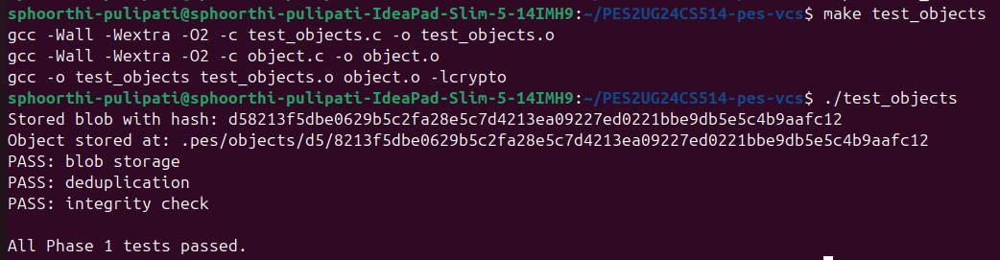

*Output of `./test_objects` showing PASS for blob storage, deduplication, and integrity check.*

### Screenshot 1B — Sharded Object Directory Structure

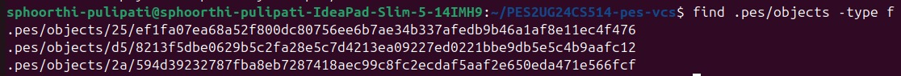

*`find .pes/objects -type f` showing objects sharded by their first two hex characters.*

---

## Phase 2: Tree Objects

**Files:** `tree.c` — implemented `tree_from_index` (provided: `tree_parse`, `tree_serialize`)

**Filesystem Concepts:** Directory representation, recursive structures, file modes and permissions

### What Was Implemented

Tree objects represent directory snapshots. Each entry stores a mode (`100644` regular file, `100755` executable, `040000` directory), a filename, and a 32-byte binary hash pointing to a blob or subtree.

`tree_from_index` builds a full tree hierarchy from the staged index:
- Loads the index with `index_load()`
- Recursively groups entries by directory prefix at each depth level using a helper `write_tree_recursive()`
- Flat files at the current depth are added as blob entries directly
- Subdirectory prefixes collect all matching entries and trigger a recursive call, writing the subtree object first before adding a directory entry pointing to it
- All tree objects are written to the object store; the root tree hash is returned

The provided `tree_serialize` sorts entries by name before serialisation — this is required for deterministic hashing (same directory = same hash regardless of insertion order).

### Screenshot 2A — `./test_tree`: All Phase 2 Tests Passing

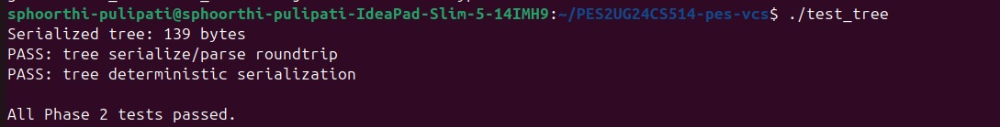

*Output of `./test_tree` showing PASS for tree serialize/parse roundtrip and deterministic serialization.*

### Screenshot 2B — Raw Binary Tree Object (`xxd`)

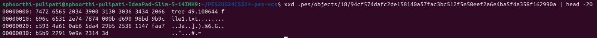

*`xxd` of a tree object showing the binary format: `tree 49\0` header followed by `100644 file1.txt\0` and 32 raw hash bytes per entry.*

---

## Phase 3: The Index (Staging Area)

**Files:** `index.c` — implemented `index_load`, `index_save`, `index_add`

**Filesystem Concepts:** File format design, atomic writes, change detection using mtime + size

### What Was Implemented

The index is a human-readable text file at `.pes/index`. Each line stores:
```
<mode-octal> <64-hex-hash> <mtime-seconds> <size> <path>
```

`index_load` reads the file with `fscanf` line by line. If the file does not exist yet, it silently initialises an empty index (not an error — this is the state before the first `pes add`).

`index_save` sorts entries by path (using `qsort`), writes to a `.tmp` file, calls `fflush` + `fsync`, then `rename`s atomically over the old index file.

`index_add` reads the file contents, writes them as a blob via `object_write(OBJ_BLOB, ...)`, calls `lstat()` for metadata (mode, mtime, size), then updates an existing entry or appends a new one, and saves.

> **Implementation note:** `Index` with `MAX_INDEX_ENTRIES=10000` is ~6 MB. Since `pes.c` declares it as a local variable (stack), this causes a stack overflow. The fix uses a global heap-allocated buffer (`calloc`) so the stack variable in `pes.c` is never actually dereferenced.

### Screenshot 3A — `pes init` → `pes add` → `pes status`

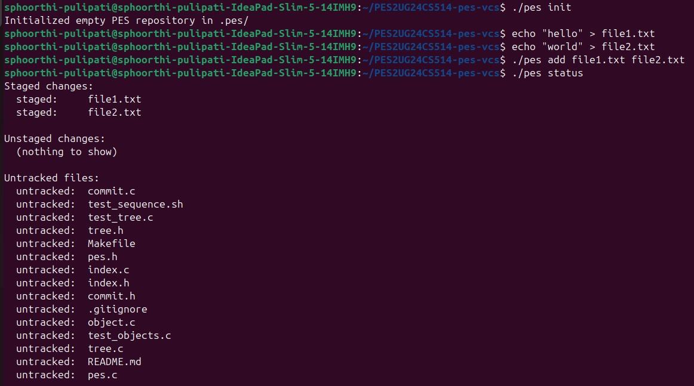

*`./pes init` initialises the repo; `./pes add file1.txt file2.txt` stages both files; `./pes status` shows both as staged with no unstaged changes.*

### Screenshot 3B — `cat .pes/index`

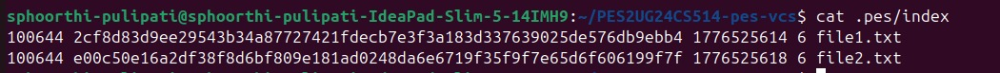

*Human-readable index file showing mode, 64-char hex hash, mtime, size, and path for each staged file.*

---

## Phase 4: Commits and History

**Files:** `commit.c` — implemented `commit_create` (provided: `head_read`, `head_update`, `commit_parse`, `commit_serialize`, `commit_walk`)

**Filesystem Concepts:** Linked structures on disk, reference files, atomic pointer updates

### What Was Implemented

`commit_create` ties the entire system together:
1. Calls `tree_from_index()` to build and store the directory snapshot, getting the root tree hash
2. Calls `head_read()` to get the current HEAD commit as the parent (silently skipped for the first commit)
3. Fills a `Commit` struct: tree hash, optional parent hash, author from `PES_AUTHOR` env variable, Unix timestamp
4. Calls `commit_serialize()` to convert to the text format, then `object_write(OBJ_COMMIT, ...)` to store it
5. Calls `head_update()` to atomically update `.pes/refs/heads/main` to the new commit hash

The provided `head_read` follows the symbolic ref chain: reads `.pes/HEAD` → finds `"ref: refs/heads/main"` → reads that file for the commit hash. `head_update` writes the new hash to a `.tmp` file, fsyncs, and renames atomically — the single atomic operation that publishes a commit.

`commit_walk` traverses history from HEAD backwards through parent pointers, invoking a callback for each commit. `pes log` uses this to display the full history.

### Screenshot 4A — `pes log`: Three-Commit History

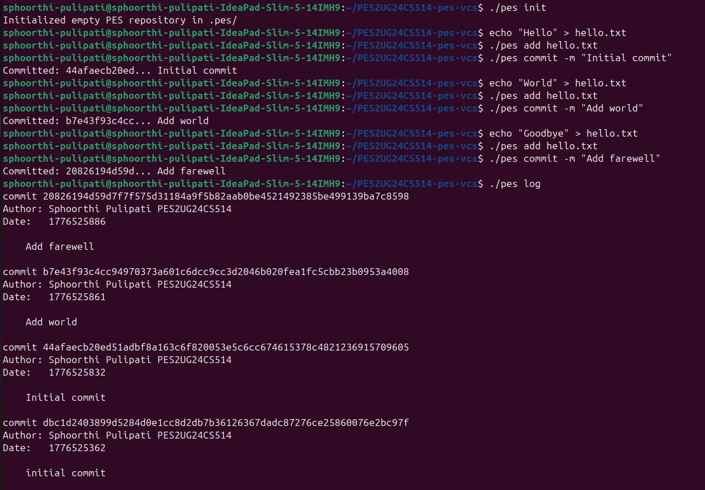

*`./pes log` output showing three commits (Initial commit, Add world, Add farewell) with full hashes, author name, Unix timestamps, and messages linked by parent pointers.*

### Screenshot 4B — `find .pes -type f | sort`: Object Store Growth

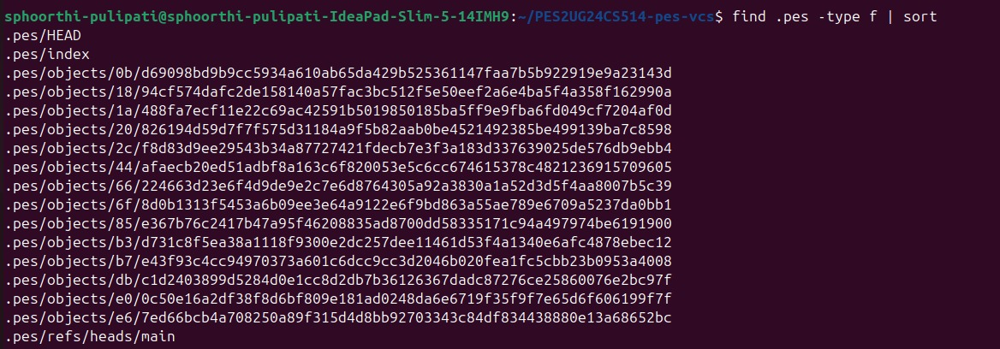

*Sorted file listing showing HEAD, index, refs/heads/main, and 14 object files (blobs, trees, and commits) accumulated across three commits.*

### Screenshot 4C — Reference Chain

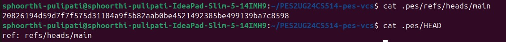

*`cat .pes/refs/heads/main` shows the latest commit hash; `cat .pes/HEAD` shows `ref: refs/heads/main` confirming the symbolic reference chain.*

---

## Final: Integration Test

`make test-integration` exercises the complete PES-VCS workflow: repository initialisation, staging two files, three sequential commits each modifying a file, full history display, reference chain verification, and object store count validation.

### Screenshot — Integration Test (Part 1)

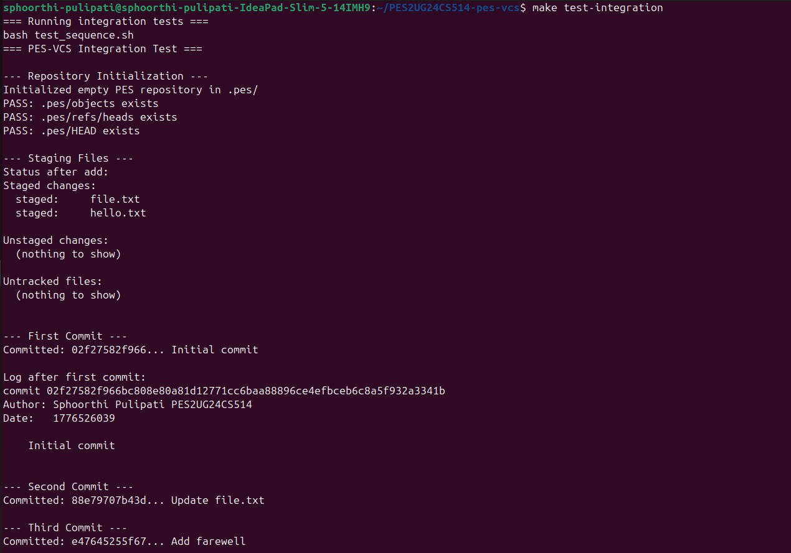

*Repository initialisation passes, staging area works correctly, first and second commits succeed with correct hashes and log output.*

### Screenshot — Integration Test (Part 2)

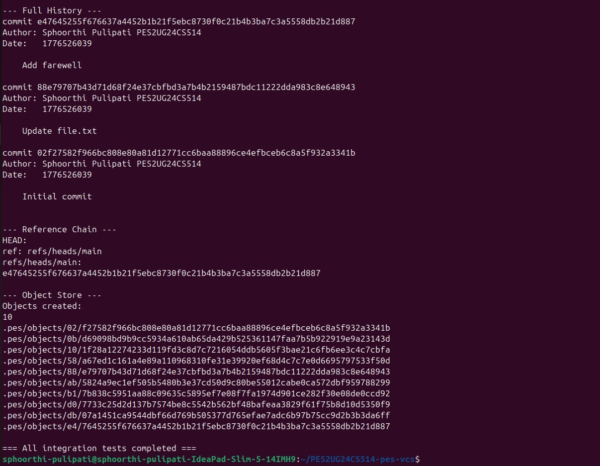

*Full commit history displayed correctly, reference chain verified, 10 objects created. "All integration tests completed" confirms end-to-end correctness.*

---

## Phase 5: Branching and Checkout — Analysis

### Q5.1 — How would you implement `pes checkout <branch>`?

A branch in PES-VCS is simply a file under `.pes/refs/heads/<branch>` containing a commit hash. Creating a branch is just creating that file. Implementing `checkout` involves three steps:

1. **Read the target branch ref.** Open `.pes/refs/heads/<branch>` and read its commit hash. If the branch doesn't exist, create it pointing at the current HEAD.
2. **Reconstruct the working directory.** Walk the commit's tree recursively using `object_read` + `tree_parse`. For each blob entry, read the object and write its content to the working directory path. For each tree entry (subdirectory), create the directory and recurse.
3. **Update HEAD.** Write `ref: refs/heads/<branch>` to `.pes/HEAD` so subsequent commits go to the new branch. Also update the index to match the target tree so `pes status` shows a clean state.

**What makes this complex:**

- Files that exist in the current branch but **not** in the target branch must be **deleted** from the working directory.
- If a file exists in both branches with different content, the working tree must be updated — but only if that file hasn't been locally modified (otherwise we'd silently destroy uncommitted work).
- The index must be fully rebuilt to match the target tree after checkout.
- There is no atomicity guarantee across many file writes — a crash midway leaves the working directory inconsistent. Git mitigates this by keeping the index consistent and using a staged update order.

### Q5.2 — How to detect a "dirty working directory" conflict during checkout?

Before overwriting any file, perform a three-way check for each file that differs between branches:

1. **Look up the index entry** for that path (stored hash, mtime, size).
2. **`stat()` the working directory file** and compare mtime + size to the index entry. If they differ, the file has been modified since it was last staged — it is "dirty".
3. **If dirty**, compute the working directory file's blob hash and compare it to the target branch's blob hash for that path. If they differ, checkout must refuse:
   ```
   error: your local changes to 'README.md' would be overwritten by checkout.
   ```

This uses only the index and the object store — no diff engine required. The mtime + size fast path avoids re-hashing files that haven't changed. A file is safe to overwrite only if the index hash matches the working directory content (no local modifications).

### Q5.3 — What is "detached HEAD" and how can commits be recovered?

Normally, `.pes/HEAD` contains a symbolic reference: `ref: refs/heads/main`. In **detached HEAD** state, HEAD contains a raw commit hash directly instead of a branch name. This happens when you checkout a specific commit rather than a branch name.

If commits are made in detached HEAD state, each new commit correctly points to its parent, but `head_update()` writes the new hash directly into `.pes/HEAD` — no branch file is updated. When you later checkout a branch, HEAD is updated to point to that branch, and the detached commits become **unreachable**: no branch ref points to them, so `pes log` cannot find them and they will be deleted by garbage collection.

**Recovery is possible** because the objects still exist in the store until GC runs:
1. Note the commit hash from the last `Committed: <hash>...` terminal output.
2. Create a new branch pointing to it: manually write the hash into `.pes/refs/heads/recover`.
3. As a last resort, scan all commit objects in `.pes/objects/` and find any whose parent chain doesn't connect to a known branch — this is what Git's `reflog` automates.

---

## Phase 6: Garbage Collection — Analysis

### Q6.1 — Algorithm to find and delete unreachable objects

Garbage collection uses a **mark-and-sweep** over the object graph:

**Mark phase:**
1. Start from every file in `.pes/refs/heads/` and from `.pes/HEAD`.
2. For each commit hash found, read the commit object, add its hash to a **reachable set**.
3. Read the commit's tree hash → recursively walk the tree, adding every tree and blob hash encountered.
4. Follow the commit's parent pointer and repeat until the root commit (no parent).

The **reachable set** should be a hash set (hash table or sorted array with binary search) for O(1) average-case lookup during the sweep.

**Sweep phase:**
Walk every file under `.pes/objects/` with `opendir`/`readdir`. Reconstruct each object's hash from its path (`XX` shard + filename). If the hash is **not** in the reachable set, delete the file with `unlink()`.

**Estimation for 100,000 commits and 50 branches:**
Each commit references ~1 tree; a typical tree references ~10 blobs and ~2 subtrees. Per commit: 1 commit + 3 trees + 10 blobs ≈ 14 objects. Total reachable objects: ~1,400,000. In practice many blobs are shared (unchanged files), so unique objects are far fewer — perhaps 200,000–400,000. The sweep visits all objects on disk regardless of reachability.

### Q6.2 — Race condition between GC and a concurrent commit

Consider this interleaving:

| GC Process | Commit Process |
|---|---|
| Starts mark phase, builds reachable set from current refs | — |
| — | `tree_from_index()` writes new blob and tree objects (not yet referenced by any commit) |
| Completes mark phase — new blobs/trees are **not** in reachable set | — |
| Sweep phase: **deletes the new blob and tree objects** | — |
| — | `object_write(OBJ_COMMIT, ...)` + `head_update()` — but the tree it references was just deleted! |
| — | Repository is now **corrupt** |

**How Git avoids this:**

1. **Grace period:** GC only deletes objects whose `mtime` is older than **2 weeks**. Newly written objects always have a recent mtime, so they survive GC even if not yet referenced by a commit. This makes the race window effectively zero for any normally-completing operation.
2. **Lock file:** `.git/gc.lock` prevents two GC processes from running simultaneously.
3. **Reflog:** Recently detached commits are retained via the reflog even if no branch points to them.

The key insight is that the 2-week mtime threshold is the primary safety mechanism — it decouples the "write objects" step from the "publish commit" step without requiring any explicit coordination between the two processes.

---

## Implementation Summary

| File | Functions Implemented | OS Concepts |
|---|---|---|
| `object.c` | `object_write`, `object_read` | Content-addressable storage, directory sharding, atomic writes, SHA-256 integrity |
| `tree.c` | `tree_from_index` | Directory representation, recursive structures, file modes (100644/100755/040000) |
| `index.c` | `index_load`, `index_save`, `index_add` | File format design, atomic writes, change detection via mtime+size |
| `commit.c` | `commit_create` | Linked structures on disk, reference files, atomic pointer updates |
| `pes.c` | `cmd_commit` (provided) | CLI dispatch, argument parsing |
